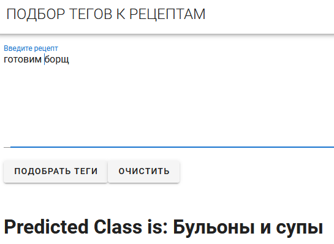

# Классификатор рецептов 

Work in progress

Простое приложение, позволяющее отнести текст рецепта к определенному классу (супы, салаты, горячее и т.д.)

Проект состоит из 3 частей - ML, Back и Front. Фронт и бэк живут как отдельные приложения на heroku.

## ML
Собственно модель, натренированная на соскрапленных данных. Под капотом - tfidf и логрег.

## Back
Фласковое приложение с одной ручкой `/predict`, которая получает текст рецепта в теле POST-запроса:
```
{"input":" готовим борщ "}
```
классифицирует и отдает результат в формате:
```
{"response": "Бульоны и супы"}
```

## Front
Синглпейдж на Vue. Текстовое поле для ввода рецепта и кнопка "предсказать", которая ходит на бэк с введенным текстом.

